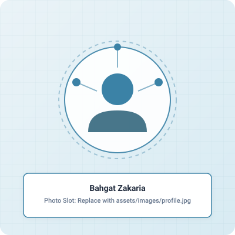

# Bahgat Zakaria — Data Engineering Freelance Portfolio

A clean, modern, fast, accessible, and responsive portfolio website designed specifically for **Junior Data Engineer / Freelance Data Engineer** positioning.

Built with semantic **HTML5**, custom properties **CSS3** (instant Light/Dark theme switching), and modular **ES6 Vanilla JavaScript** with zero heavy dependencies or framework overhead.

---

## 📁 Project Structure

```
portfolio/
├── index.html                   # Main single-page portfolio application
├── case-studies/                # Standalone full-page case studies
│   ├── hospital-data-cleaning.html
│   └── data-warehouse-etl.html
├── css/
│   ├── main.css                 # CSS variables, typography, reset, base layout
│   ├── components.css           # Header, buttons, cards, modals, image containers
│   └── responsive.css           # Breakpoints & mobile responsiveness
├── js/
│   ├── theme.js                 # Light/Dark mode switcher with localStorage persistence
│   ├── projects-data.js         # Scalable project registry & case studies schema
│   ├── contact.js               # Copy email to clipboard, toast notifications, form validation
│   └── main.js                  # Mobile drawer, ScrollSpy, filter tabs, modal controller
├── assets/
│   ├── cv/
│   │   └── Bahgat_Zakaria_CV.pdf       # Downloadable CV file (drop your real CV here)
│   └── images/
│       ├── profile-placeholder.svg     # Hero photo placeholder
│       ├── hospital-profiling.svg      # Hospital Project: Profiling slot
│       ├── hospital-cleaning.svg       # Hospital Project: Cleaning code slot
│       ├── hospital-validation.svg     # Hospital Project: Validation slot
│       ├── dwh-architecture.svg        # DWH: Medallion Architecture diagram slot
│       ├── dwh-sql-server.svg          # DWH: SQL Server ETL code slot
│       ├── dwh-star-schema.svg         # DWH: Star Schema model slot
│       ├── dwh-analytics.svg           # DWH: Analytics gold layer slot
│       └── favicon.svg                 # Data engineering database favicon
└── README.md                    # This documentation file
```

---

## 🎨 Color Palette Reference

| Element | Light Mode | Dark Mode |
| :--- | :--- | :--- |
| **Background** | `#F8FAFC` | `#0F172A` |
| **Surfaces / Cards** | `#FFFFFF` | `#1E293B` |
| **Primary Text** | `#1E293B` | `#F1F5F9` |
| **Secondary Text** | `#64748B` | `#94A3B8` |
| **Primary Accent** | `#3B82A6` | `#5FA8C7` |
| **Dark Accent** | `#285E75` | `#3B7D99` |
| **Borders** | `#E2E8F0` | `#334155` |
| **Soft Accent Background** | `#EAF3F7` | `#172B36` |

---

## 🔄 How to Customize Your Content

### 1. Replacing Your Profile Photo
1. Save your professional headshot image as `profile.jpg` (or `profile.png`).
2. Place it in `assets/images/profile.jpg`.
3. In `index.html` (around line 180), change:
   ```html
   
   ```
   to:
   ```html
   
   ```

---

### 2. Replacing Project Screenshots
Drop your real screenshots directly into `assets/images/`:
- **Hospital Project**:
  - `hospital-profiling.png` (Profiling report)
  - `hospital-cleaning.png` (Pandas code / cleaning flow)
  - `hospital-validation.png` (Validation results)
- **Data Warehouse Project**:
  - `dwh-architecture.png` (Bronze → Silver → Gold diagram)
  - `dwh-sql-server.png` (SQL Server stored procedures)
  - `dwh-star-schema.png` (Star Schema diagram)
  - `dwh-analytics.png` (Analytical query view)

Then update the filenames in `js/projects-data.js` and the standalone case study pages.

---

### 3. Replacing Your CV File
1. Export your finalized resume as a PDF named `Bahgat_Zakaria_CV.pdf`.
2. Overwrite the file at `assets/cv/Bahgat_Zakaria_CV.pdf`.
3. The "Download CV" button in the Hero section will automatically serve your new file.

---

### 4. Updating Contact Information & Social Links
- **Email**: Update `bahgat.zakaria.de@placeholder.com` in:
  - `index.html` (Contact section)
  - `js/contact.js` (`CONTACT_EMAIL` constant)
- **LinkedIn**: Replace `linkedin.com/in/bahgat-zakaria-placeholder` with your actual LinkedIn profile URL in `index.html`.
- **GitHub**: The Data Warehouse project is already linked to:
  `https://github.com/bahgatzakaria653-dev/sql_data_wharehouse_project`.

---

### 5. Adding New Projects in the Future
To add a 3rd or 4th project, open `js/projects-data.js` and simply add a new JSON object to the `PROJECTS_DATA` array:
```javascript
{
  id: "your-new-project-id",
  title: "Your Project Title",
  category: "cleaning-quality", // or "warehousing-etl"
  categoryLabel: "Data Cleaning & Quality",
  shortDescription: "...",
  technologies: ["Python", "SQL", "..."],
  problem: "...",
  solution: "...",
  keyConcepts: ["..."],
  githubUrl: "https://github.com/...",
  githubAvailable: true,
  imageSlots: [...],
  caseStudy: { ... }
}
```
Then duplicate a `.project-card` block in `index.html` or let the JavaScript render it dynamically.

---

## 🚀 How to Run Locally

You can open `index.html` directly in any web browser, or run a lightweight local server:

### Using Python:
```bash
python -m http.server 8000
```
Then open `http://localhost:8000` in your browser.

### Using VS Code:
Install the **Live Server** extension and click **"Go Live"**.

---

## 🌐 Free Deployment Options

- **GitHub Pages**: Push this folder to a GitHub repository, go to **Settings → Pages**, and select `main` branch root.
- **Netlify**: Drag and drop the `portfolio/` folder into Netlify Drop for instant 0-configuration hosting.
- **Vercel**: Import your GitHub repository into Vercel as a static site.
